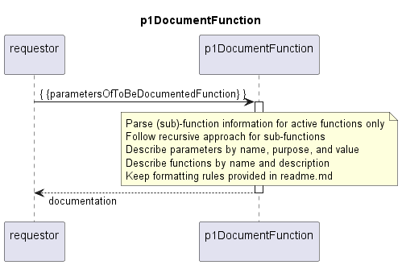

# p1DocumentFunction

p1DocumentFunction receives the hierarchical parameters object of a function.  
It uses a recursive approach to create the documentation for that function and all of its active sub‑functions from that.  
The documentation is a formatted string.  

## Parsing rules

- Only active functions are to be considered.  
  If a function's IsActive field is not true, the entire function — including its parameters and sub‑functions — is skipped.
- Retain of the active functions:
  - functionName
  - description
  - all string parameters, keeping only their
    - parameterName
    - purpose, and
    - value
- A function can contain string parameters and sub‑functions, but it may also have none of them, depending on the specific function
- Sub‑functions are parsed recursively using the same rules

## Documentation output format

The documentation shall be provided as text in format example given below.  

- (Sub-)Function entries must use a hyphen (-) as bullet point
- String parameters must use a dot (.) as bullet point
- Indentation levels must follow a fixed, YAML‑style structure:
  - each nested element is indented consistently using 2 spaces,
  - and all text aligns exactly as shown in the example.
- Descriptions always appear directly under their respective item, using the same indentation level as the item's label.

``` text
- functionName
  text of the functionDescription
  . stringName
    text of the stringPurpose
    text of the stringValue
  . stringName
    text of the stringPurpose
    text of the stringValue
  - sub-functionName
    text of the functionDescription
    . stringName
      text of the stringPurpose
      text of the stringValue
    - sub-functionName
      text of the functionDescription
    - sub-functionName
      text of the functionDescription
      - sub-functionName
        text of the functionDescription
  - sub-functionName
    text of the functionDescription
    - sub-functionName
      text of the functionDescription
```

## Diagram

<p align="center">
  
</p>

## Interface

Please find a detailed description of the [interface](./interface.yaml).  

## Variables

Please find a detailed description of the [variables](./variables.yaml).  

## NPM Module

[mw-sdn-p1-document-function](https://www.npmjs.com/package/mw-sdn-p1-document-function)  
