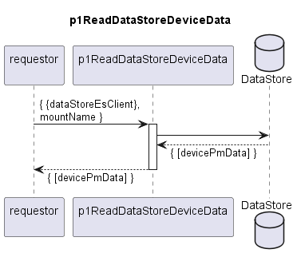

# p1ReadDataStoreDeviceData

Reads and returns data store content according to the handed over input resource path.  

## Diagram

  

## Interface

Please find a detailed description of the [interface](./interface.yaml).  

## Variables

Please find a detailed description of the [variables](./variables.yaml).  

## NPM Module

[mw-sdn-p1-read-data-store-device-data](https://www.npmjs.com/package/mw-sdn-p1-read-data-store-device-data)  
