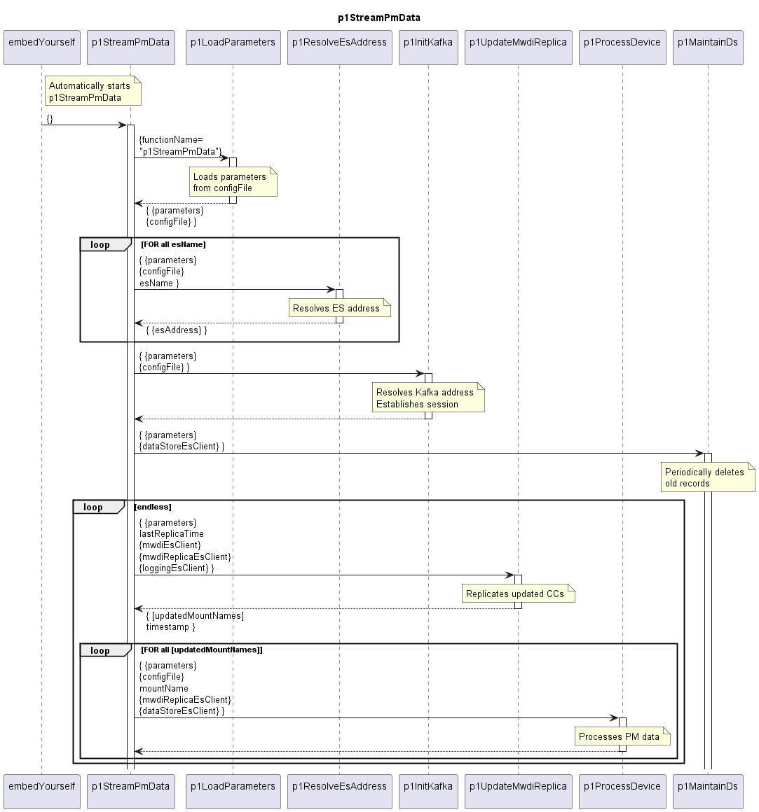

# p1StreamPmData

The p1StreamPmData is cyclically processing:  

- Replicate updated ControlConstructs from the MWDI ES index into the MWDI ES Replica index (which holds the raw data for processing PM data in the DPMDP)
- Initiate the processing of PM data of the updated ControlConstructs

## Diagram

  

## Interface

Detailed description of the [interface](./interface.yaml).  

## Variables

Detailed description of the [internal variables](./variables.yaml).  
