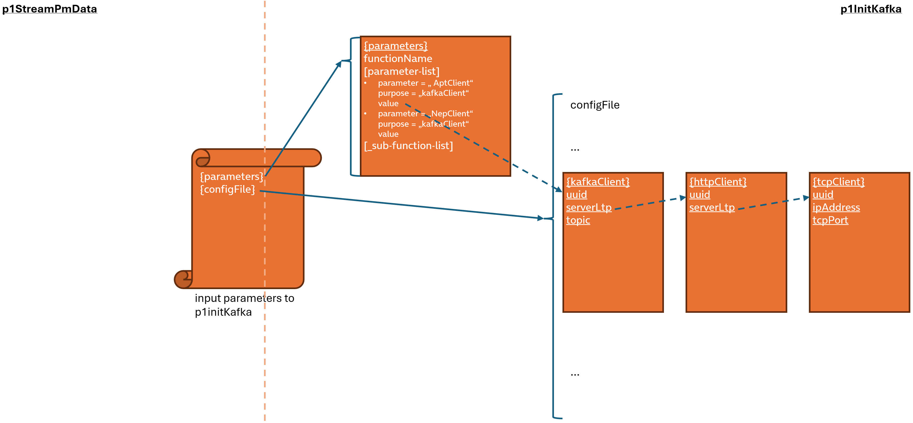
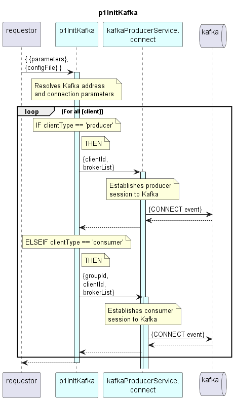

# p1InitKafka

Resolves Kafka address and initializes the Kafka session.

### Parameter Handling

  
  

  

### Diagram  

  
  

  

### Interface

Please find a detailed description of the [interface](./interface.yaml).  

### Variables

Detailed description of the [internal variables](./variables.yaml).  

### Parameters

| Parameter Name               | Description                                                                        |
|------------------------------|------------------------------------------------------------------------------------|
| [kafkaClientName]            | Special usage of the parameters. parameter-name is not static. For all parameters with purpose=="kafkaClient", parameter-name contains a kafkaClientName and value contains the kafkaClientUuid |

### NPM Module

[mw-sdn-p1-init-kafka](https://www.npmjs.com/package/mw-sdn-p1-init-kafka)  

