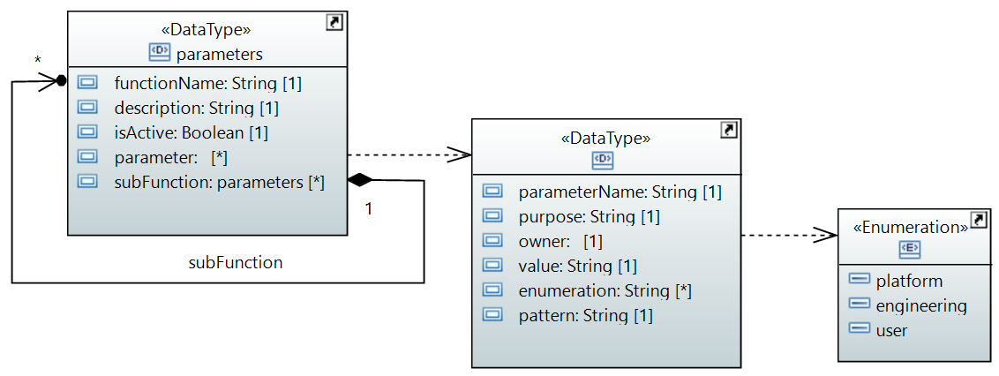
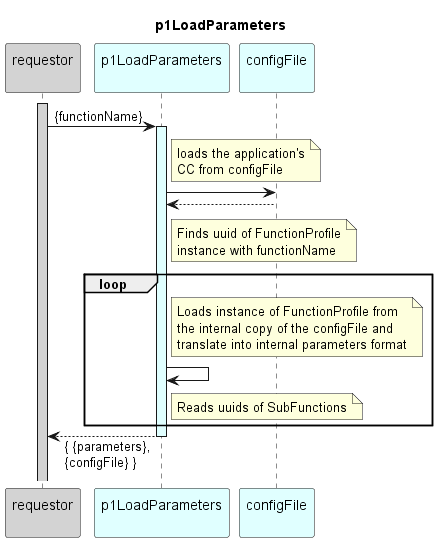

# p1LoadParameters  

Loads the parameters of the defined Function (input) and its sub-Functions from the configFile and returns it in the internal recursive parameters format.  

### Parameters Structure

Within most Functions, processing can be influenced by parameters.  
Parameters are configurable, while variables can change with each Function call.  
The values of the parameters are stored in the CONFIGfile.  
The parameters of all Functions are read by the p1LoadParameters Function and converted into a standard format.  
This format supports passing the parameters between Functions.  
It allows the same Function to be called in different contexts with different parameters.  
Its recursive information model can be used to create hierarchies of any depth in the resulting data tree.  

  
  

  

### Diagram  

  
  

  

### Interface  

Please find a detailed description of the [interface](./interface.yaml).  

### Variables

Please find a detailed description of the [variables](./variables.yaml).

### NPM Module  

[mw-sdn-p1-load-parameters](https://www.npmjs.com/package/mw-sdn-p1-load-parameters)  

