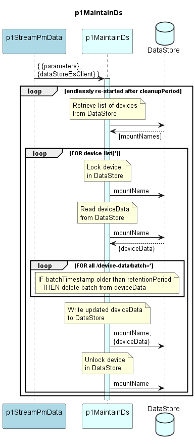

# p1MaintainDs

Periodically deletes resultsCc (with batchTimestamp older than dataStoreRetentionPeriod) from the dataStore  
(It does not cover deletion of devices from the dataStore)

### Diagram  

  
  

  

### Interface  

Please find a detailed description of the [interface](./interface.yaml).  

### Variables

Please find a detailed description of the [variables](./variables.yaml).

### Parameters

| Parameter Name               | Description                                                  |
|------------------------------|--------------------------------------------------------------|
| dataStoreCleanupPeriod       | Time period between two cleanup runs                         |
| dataStoreRetentionPeriod     | Time period for which data is retained before deletion       |

