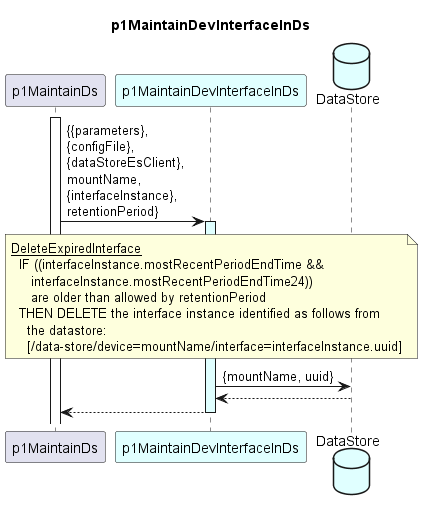

# p1MaintainDevInterfaceInDs

Maintains an interface instance in the dataStore (identified by the mountName of the parent device
and uuid of this interface instance) by deleting it from the dataStore if it has expired.

The *retentionPeriod* is handed over by the caller explicitly not as function parameter, as the *retentionPeriod* is a function parameter of the parent function (p1MaintainDs) and shall be used for all *retentionPeriod*-dependent deletions.

#### Processing

### Diagram  

  
  

  

### Interface  

Please find a detailed description of the [interface](./interface.yaml).  

### Variables

Please find a detailed description of the [variables](./variables.yaml).
