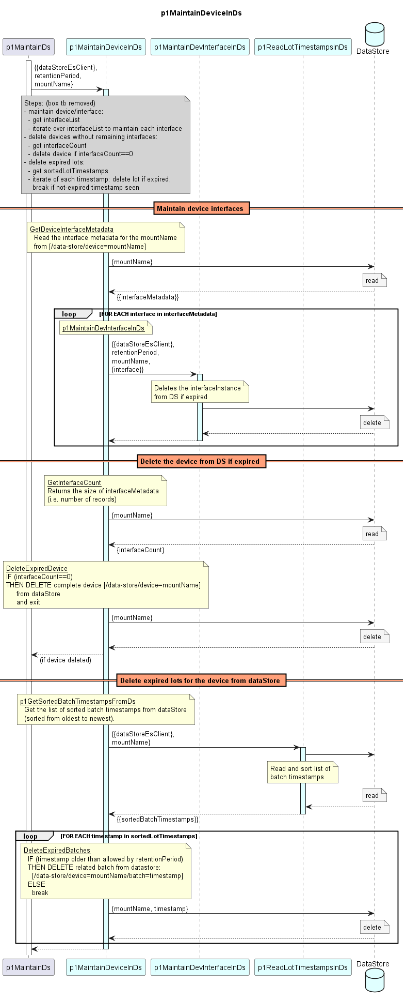

# p1MaintainDeviceInDs

Maintains data stored for a target device in the DPMDP dataStore by cleaning up expired data.

#### Processing

### Diagram  

  
  

  

### Interface  

Please find a detailed description of the [interface](./interface.yaml).  

### Variables

Please find a detailed description of the [variables](./variables.yaml).
