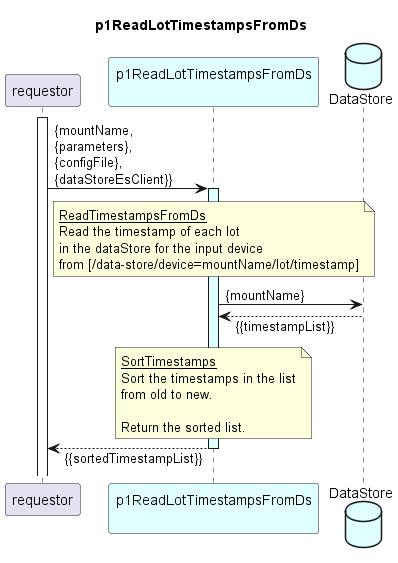

# p1ReadLotTimestampsFromDs

Reads the lot timestamps of an input device from dataStore and returns these as a sorted list (from oldest to newest date).
#### Processing

### Diagram  

  
  

  

### Interface  

Please find a detailed description of the [interface](./interface.yaml).  

### Variables

Please find a detailed description of the [variables](./variables.yaml).
