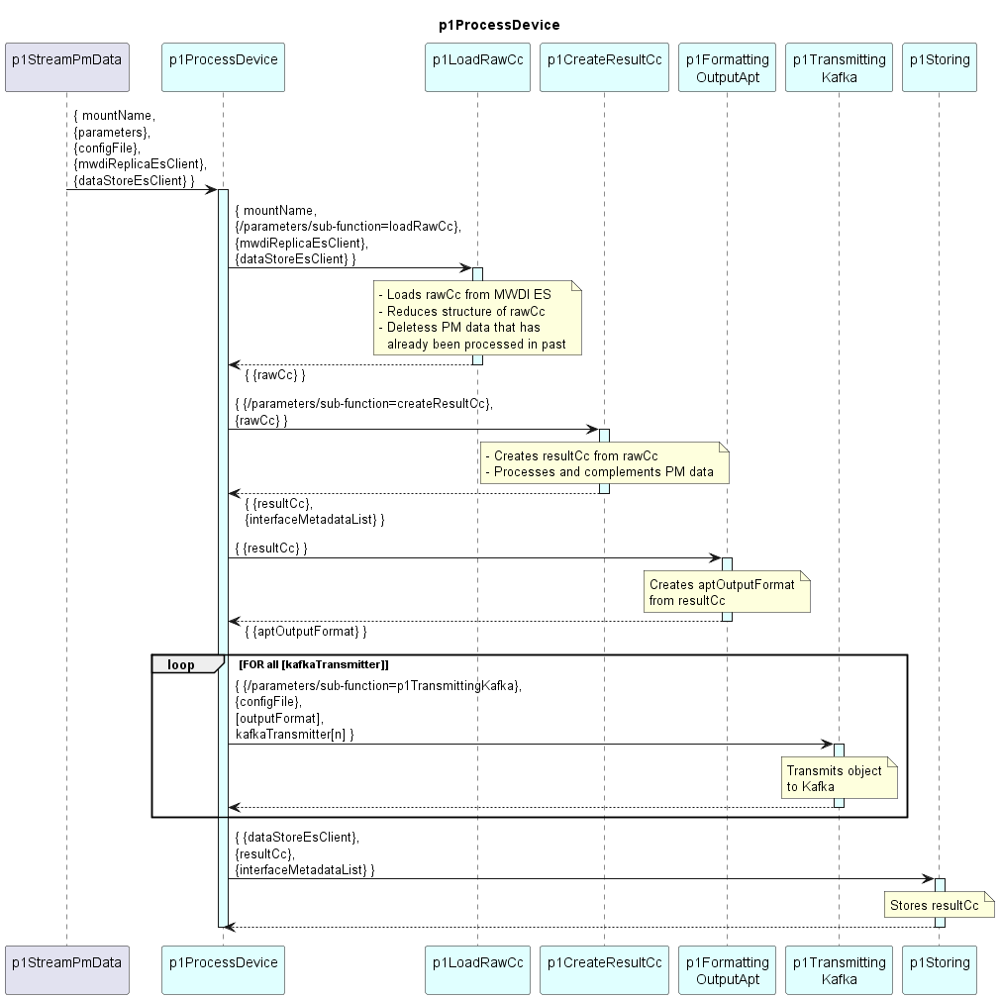

# p1ProcessDevice  

Orchestrates the device-wise processing, formatting, sending and storing of PM data.  

#### Segmentation  

Calculating the PM data is separated from formatting and transmitting.  

Separating formatting from calculating allows composing multiple output formats from the same calculated PM data.  
Separating transmitting from formatting allows ...  
- ... sending the same output format through multiple transmission methods and  
- ... sending multiple output formats via the same transmission method.  

#### Processing  

The p1ProcessDevice starts with creating a data structure for holding raw data, results, output formats and administrative information.  

The p1ProcessDevice executes a hard coded sequence of Functions.  
Before calling a Sub-Function, it checks for the Sub-Function being activated in its parameters.  

Parameters for these Sub-Functions are handed over as sub-trees of the parameters object.  

Output objects of the Sub-Functions are attached to the p1ProcessDevice's data structure.  

### Diagram  

  
  

  

### Interface  

Please find a detailed description of the [interface](./interface.yaml).  

### Variables

Please find a detailed description of the [variables](./variables.yaml).

### Parameters

| Parameter Name               | Description                                                                        |
|------------------------------|------------------------------------------------------------------------------------|
| [kafkaTransmitter]           | Special usage of the parameters. parameter-name is not static. For all parameters with purpose=="kafkaTransmitter", parameter-name contains a kafkaTransmitter |

