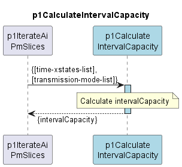

# p1CalculateIntervalCapacity

Calculates the average capacity provided by an AirInterface within a given interval.  

### Overview

The capacity of a transmission mode is multiplied by the time this transmission mode was active.  
This results in a volume offered by this transmission mode.  

The offered volumes are summed up across all transmission modes.  
This results in the total offered volume.  

The total offered volume is divided by the length of the interval.  
This results in the average capacity provided by the AirInterface within the given interval.  

### Diagram

	

### Interface

Please find a detailed description of the [interface](interface.yaml).

### Variables

Please find a detailed description of the [variables](variables.yaml).

### NPM Module  

[mw-sdn-p1-calculate-interval-capacity](https://www.npmjs.com/package/mw-sdn-p1-calculate-interval-capacity)  

### Remarks

Calling this Function has been moved from p1PrepareTxModes to p1IterateAiPmSlices.  
