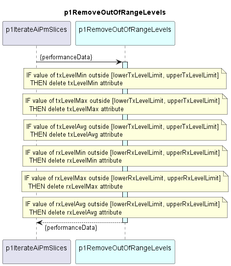

# p1RemoveOutOfRangeLevels

Deletes RX level and TX level performance (min, max, avg) attributes with values outside pre-defined range from ResultCc.  
Borders of the valid range are configurable parameters.  

### Diagram

  

### Interface

Please find a detailed description of the [interface](interface.yaml).

### Variables

Please find a detailed description of the [variables](variables.yaml).

