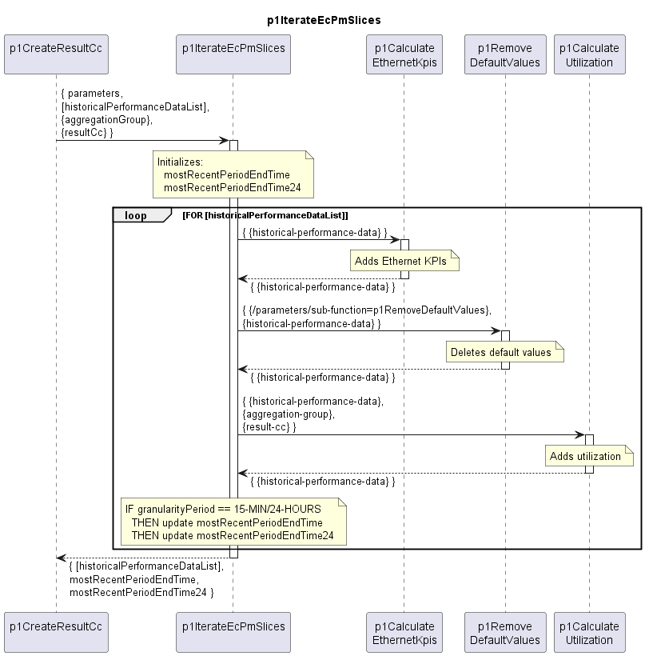

# p1IterateEcPmSlices

Iterates through all EthernetContainer historical performance data slices and calls the processing Functions.  

### Diagram

  

### Interface

Please find a detailed description of the [interface](interface.yaml).

### Variables

Please find a detailed description of the [variables](variables.yaml).

### Parameters

Just passing through parameters to sub-functions.  

