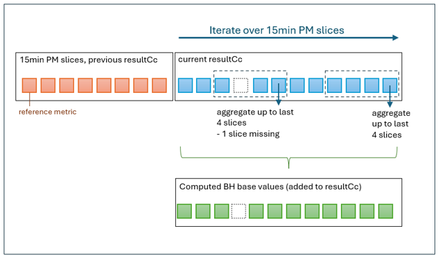

# Busy Hour KPI Computation

### Busy Hour Definition

Die busy hour bezieht sich auf einen individuellen EthernetContainer (logisches Ethernet Interface).  
Es gibt genau eine busy hour pro Kalendertag.  
Die busy hour stellt den Beobachtungszeitraum dar, während dem an diesem Kalendertag die maximale Datenmenge übertragen wurde.  

Beobachtungszeiträume beginnen und enden zur vollen Stunde.  
D.h. es ergeben sich genau 24 Beobachtungszeiträume pro Kalendertag.  

Die Messung der übertragenen Datenmenge bezieht sich nicht auf Stunden, sondern auf 15 Minuten lange Perioden.  
Es wird unterstellt, dass die Geräte so programmiert sind, dass die 15-Minuten-Messperioden zur vollen Stunde (und 15, 30 bzw. 45 Minuten danach) beginnen.  

Die im Beobachtungszeitraum übertragene Datenmenge berechnet sich als Summe der Datenmengen, die in den vier Messperioden, die in den Beobachtungszeitraum fallen, gemessen wurden.  
Sollten weniger als die vier erwarteten Messwerte vorliegen, werden nur die vorhandenen Messwerte addiert.  

Als Messwert wird das folgende Attribut ausgewertet:  
/ethernet-container-2-0:ethernet-container-pac/ethernet-container-historical-performances/historical-performance-data-list/performance-data/total-bytes-output  
Die offizielle semantische Definition des Messwertes lautet:  
"Total number of Bytes of Ethernet traffic (before header compression) transmitted (in direction out of the device) during the measurement period."  
Die Maßeinheit des Messwertes lautet: Byte  
Es handelt sich damit um eine reine Mengenangabe, keine Flussgröße.  

### Busy Hour Performance Indikatoren

Die Busy Hour Performance Indikatoren werden zusammen mit den anderen Performance Indikatoren des selben Kalendertages prozessiert und im resultCc gespeichert.  
Es wird unterstellt, dass die Geräte so programmiert sind, dass die 24-Stunden-Messperioden mit dem Kalendertag beginnen.  

Der Name und der Ort des kombinierte Datentyps lautet:  
/ethernet-container-2-0:ethernet-container-pac/ethernet-container-historical-performances/historical-performance-data-list/busy-hour  
Er erscheint ausschließlich in Instanzen von historical-performance-data-list mit einer granularity-period von 24 Stunden.  

Der kombinierte Datentyp enthält folgende Attribute:  
- period-end-time-list  
- label  
- throughput  

- suspicious-result-flag  
  Dieses Attribut würde wahr anzeigen, falls sich im Rahmen der Berechnung Umstände ergaben, die das Ergebnis weniger zuverlässig erscheinen lassen.  

#### busy-hour::period-end-time-list
Liste der Werte des period-end-time Attributes der bis zu vier Messperioden, die zusammen die busy hour bilden.  
Mit diesen Werten können die Messperioden für weitere Analysen adressiert werden.  

#### busy-hour::label
Die volle Stunde zu Beginn der busy hour wird in folgendem Format dargestellt: YYYY/MM/DD/hh/mm.  
Mit diesen Werten wird die busy hour in anderen Tools und Datenvorräten bezeichnet.  

#### busy-hour::throughput
Der busy hour throughput ist die Datenmenge, die während der busy hour hypothetisch im Mittel in einer (=1) von 3600 Sekunden gesendet wurde.  
D.h. die in Bytes ausgedrückte Datenmenge ist in bits umzurechnen und durch die statisch angenommene Länge des Beobachtungszeitraums (3600 Sekunden) zu teilen.  

Die Einheit des busy hour throughput ist bit/s.  
Es handelt sich also um eine Flussgröße keine reine Menge.  
Die Mittelwertbildung über 3600 Sekunden wirkt stark glättend.  
Dass die aufsummierte Länge der Messperioden von 3600 Sekunden abweichen könnte, wird ignoriert.  

# Segmentation

Das Problem zerfällt in folgende Segmente:

- Berechnung der aggregierten Datenmenge für einen Beobachtungszeitraum  
  Für alle 15-Minuten-Messperioden, die zur vollen Stunde endeten, sind die Datenmengen, die in den vergangenen vier Messperioden gemessen wurden, aufzuaddieren.  
  Problem: Es fehlen bis zu drei Messwerte zu Beginn des Batches.  

- Vergleich der aggregierten Datenmengen aller Beobachtungszeiträume eine Tages  
  Für alle 24-Stunden-Messperioden, sind die aggregierten Datenmengen der letzten 24 Beobachtungszeiträumen, zu vergleichen.  
  Der Beobachtungszeitraum mit der höchsten aggregierten Datenmenge wird zur Busy Hour definiert.  
  Die Werte der period-end-time Attribute der vier beteiligten 15-Minuten-Messperioden werden in das busy-hour Attribut in der 24-Stunden-Messperiode eingetragen.
  Der Wert des throughput Attributs wird berechnet und in das busy-hour Attribut in der 24-Stunden-Messperiode eingetragen.

- Berechnung aller Busy Hour Performance Indikatoren

The Busy Hour represents the hour with the highest traffic load of the day, calculated based on a chosen reference attribute or metric. This hour does not necessarily align with a fixed clock hour, but may be a sliding 60‑minute window (e.g., 12:16–13:15, rather than 12:00-12:59). Once the Busy Hour (timestamp) is identified, it can be used to derive the corresponding values of other attributes or KPIs, such as utilization during the Busy Hour.

## What shall be provided?

The attributes and KPIs to be provided depend on the interface.  
For AirInterface they are:
- *unitID*
- BH timestamp
- BH intervalCapacity (TX)

For EthernetContainer they are:
- *portName*
- BH timestamp
- BH utilization (TX)
- BH traffic (TX)
- BH linkbonding capacity (TX) (i.e. BH value of total-air-interface-interval-capacity)

> [!NOTE]  
> To be decided: will SDN also provide 3DBH?

## Reference attributes/metrics

The Busy Hour is individual for each interface instance of a device.  
Only TX attributes/metrics are relevant, as only TX BH KPIs will be provided.  
The following reference attributes/metrics are to be used depending on the interface type:  
- **AirInterface**: *intervalCapacity*
  - this is the actual capacity per 15min interval, computed from adaptiveModulation information
  - from [/result-cc/logical-termination-point/layer-protocol[n]/air-interface-2-0:air-interface-pac/air-interface-historical-performances/historical-performance-data-list[t]/performance-data/interval-capacity]
- **EthernetContainer**: *totalBytesOutput*
  - from [/result-cc/logical-termination-point/layer-protocol[n]/ethernet-container-2-0:ethernet-container-pac/ethernet-container-historical-performances/historical-performance-data-list[t]/performance-data/total-bytes-output]

## Determination and provisioning of BH (timestamp) and BH KPI values

To determine BH timestamp and BH KPI values from resultCC data multiple steps are necessary:
1. Process the 15min PM slices in the resultCc (*p1CreateResultCc*/*p1IterateAiPmSlices|p1IterateEcPmSlices*). Determine the BH base value for each 15min PM slice. This is limited to the entries within a single resultCc.
2. When a 24h PM record is seen in the PM data for the currently processed interface, determine the maximum BH base value of the last 24 hours. This is done across batch borders (i.e. on data from multiple resultCcs). The BH (= timestamp) is the periodEndTime of the slice where the maximum BH base value was found. (It is assumed that the maximum BH base values are unique.)
3. This BH timestamp is written into the 24h record of the currently procesed interface.
4. A service for providing BH KPI values can be called. It gets a BH timestamp as input and computes the BH KPI values from multiple resultCCs in the dataStore.

> [!IMPORTANT]
> **Sollen die Daten wirklich über einen Service on-demand berechnet und bereitgestellt werden?**
> - jeder Consumer würde den Service selbst aufrufen
>   - mind. 40.000 mal am Tag, falls Interfaces einzeln abgefragt werden müssen - 40.000*x
>   - keine gute Kontrolle über Lastverteilung (API Gateway kann zwar limitieren, aber ...)
> - wenn die Daten on-demand berechnet werden, müssten die theoretisch jedes Mal neu berechnet werden
>   - die Daten sollten zumindest, nach der Berechnung gespeichert werden
>   - bei weiteren Abfragen Daten aus dem DataStore lesen
> - Vorschlag: lieber auch über Kafka Daten liefern => DPDMP behält die volle Kontrolle über die Kommunikation/Lastverteilung
>   - wenn alle PM-Daten auf dem gleichen Weg bereitgestellt werden, ist das auch homogener

> [!NOTE]
> **TO BE DISCUSSED (1)**:  
> **Was soll der Input für den provide-BH Service sein?**  
> (Falls der Service beibehalten werden soll.)
> Der Timestamp ist individuell pro Interface auf dem Gerät, nicht pro Gerät.
> D.h. übergeben werden muss der mountName UND entweder (a) oder (b):
> - (a) die InterfaceUuid und das BH-timestamp
> - (b) eine Liste mit allen (InterfaceUuid, BH-timestamp)

> [!NOTE]
> **TO BE DISCUSSED (2)**:  
> **Lastverteilung?**  
> Das BH timestamp soll berechnet werden, wenn im resultCc das 24h PM slice zu sehen ist
> (in den Daten habe ich für ein Interface zT auch mehrere 24h slices gesehen, das ist okay, die werden rausgefiltert, weil die schon mal geliefert wurden.)
> ABER: wann wird das 24h Slice geliefert? > mutmaßlich mit dem ersten, ggf. auch zweiten Durchlauf am neuen Tag
> d.h. die Berechnung tritt hier gehäuft auf. Muss man zusätzlich die Last verteilen?
> Meine Annahme: das ist ja schon mind. auf 3 Stunden verteilt, aber wir lesen auch mehr oder weniger viele Daten nochmal aus dem DataStore aus, was einiges an Last erzeugen könnte...
>
> => **Optimierungsvorschlag**:
> - wenn man in einem resultCC ein komplettes Interface verarbeitet hat, dann könnte man für den dadurch abgedeckten Zeitbereich das lokale Maximum bestimmen (also timestamp + maximaler BH base value)
> - für jedes Interface speichert man nur die Information zum lokalen Maximum (timestamp, Wert)
>   - das könnte man im resultCc abspeichern
>   - oder direkt im DataStore
> - wenn man dann das 24h Maximum bestimmen will, muss man nicht mehr alle (bis zu 96) BH base values für jedes Interface nochmal auslesen und daraus das Maximum bestimmen, sondern man muss nur das absolute Maximum anhand der lokalen Maxima berechnen
> - falls man das direkt im DataStore speichert, könnte man die Daten noch weiter verkürzen
>   - man muss nicht alle lokalen Maxima speichern, sondern eigentlich nur jedes Mal wenn man ein resultCc fertig bearbeitet hat, bestimmen, ob das aktuell hinterlegte Maximum immer noch das (bislang) absolute Maximum ist; falls die Daten im aktuellen resultCc ein höheres Maximum sind, wird das absolute Maximum dementsprechend aktualisiert
>   - d.h. man speicher (pro Interface): in welchem batch wurde das bislang größte Maximum gesehen (batch_timestamp), was war dessen periodEndTime und BH base value
>   - Frage: kann es vorkommen, dass das ein neues 24h Slice für Interface A später bereitgestellt wird, als für Interface B auf demselben device? (also in verschiedenen resultCcs)? => falls ja, wäre es gut, wenn man die resultCcs nicht 2x aus dem DataStore lesen muss...
>   - falls normierte Timestamps zu benutzen sind, muss man ggf. noch das Datum (yyyy-MM-dd) dazuspeichern, damit man nicht Daten von 2 Tagen vermischt.

### Step 1: Determine BH base values

For each 15min PM slice the BH base value is determined:
- iterate through the 15min PM slices of the currently processed interface in the resultCc
- for each slice aggregate the reference metric to an hourly value
  - input for the hourly value are the PM slices of the last hour
  - due to 15min granularity there should be 4 slices
  - it is possible that slices in between are missing, missing slices are not to be filled with slices from previous hours. I.e. in this case less than 4 slices are aggregated
  - the limitation is the periodEndTime of each slice, they may not be older than the periodEndTime of the last (current) slice minus 1 hour (rounded to minutes)
    - example: if the periodEndTime of the current slice is 15:07, only those of the previous 3 slices are input for the BH base value, where the periodEndTime is not older than 14:07.
    - see diagram for example
- how to hourly aggregate:
  - sum(up to 4 last reference metric values) / (number of relevant slices)
  - AirInterface: sum(*intervalCapacity* values) / (number of *intervalCapacity* values)
  - EthernetContainer: sum(*totalBytesOutput* values) / (number of *totalBytesOutput* values)

> [!NOTE]
> **TO BE DISCUSSED**:  
> 1. **Was soll an der Batch-Grenze passieren?**
>   - wird einfach ignoriert, dass die Daten in einem anderen resultCc liegen (verfälschte Base values)
>   - sollen die Daten aus dem vorherigen resultCc aus dem DataStore gelesen werden?
> 2. **Normierte Stunden?!**:
>   - falls die Customer auf normierte Stunden bestehen, müsste statt der periodEndTime die normalisierte periodEndTime benutzt werden.
>   - man berechnet BH reference values, die man gar nicht braucht; ggf. kann man das optimieren

## Step 2: Determine the Busy Hour (timestamp)

> [!NOTE]
> siehe Optimierungsvorschlag oben

The Busy Hour timestamp shall be determined, once a new 24h PM slice is seen during processing of a resultCc.  
This is, again, to be done per interface instance.  
A single resultCc only contains a subset of intervals of a days data. Therefore, additional batches (resultCcs) must be read from the dataStore.  

- To determine the BH, the 15min PM slices of the multiple resultCcs must be traversed
- input are the last up to 96 15min PM slices *s*, with relevant periodEndTimes:
  - with t = *s*.periodEndTime, tref = 24hSlice.periodEndTime (timestamps rounded to minutes)
  - t ∈ ( tref-24hours, tref ]
- find the 15min slice with the maximum BH base value
- the periodEndTime of this slice is the Busy Hour (timestamp)

## Step 3: Write the Busy Hour timestamp to resultCc

The Busy Hour timestamp of the interface is written into its 24h record in the current resultCc.

## Step 4: Calculate and provide the Busy Hour KPIs

Service-Vorschlag (für den Input interface uuid und BH timestamp):
- (0) stehen im DataStore schon die berechneten BH-KPIs? falls nein, weiter bei (1), sonst bei (6)
- (1) aus dem DataStore die passenden resultCc Kandidaten raussuchen
  - das batch_timestamp ist nur das neuestes currentAirInterface timestamp und daher nur bedingt aussagekräftig
- (2) auf diese resultCcs den FieldsFilter anwenden, so dass nur noch relevante Attribute übrig bleiben
- (3) dann in dem reduzierten resultCc für das Zielinterface prüfen, ob es ein record zum timestamp gibt
  - man kann hier ggf. erstmal prüfen, wie die erste und letzte periodEndTime aussehen (unter der Annahme, dass die von alt nach neu sortiert sind); wenn der Zeitraum nicht passt, kann man das resultCc verwerfen
  - ACHTUNG: es kann sein, dass die Daten über zwei resultCcs verteilt sind
  -> die 4 (oder weniger) relevanten 15min slices raussuchen
- (4) KPIs berechnen
- (5) Berechnete Werte in den DataStore schreiben
- (6) Daten bereitstellen

