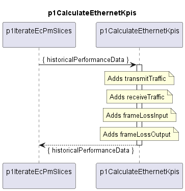

# p1CalculateEthernetKpis

Adds Ethernet KPIs to the historicalPerformanceData set. 

  
### Overview

This function processes a single PM data slice and adds:  
- transmitTraffic
- receiveTraffic
- frameLossInput
- frameLossOutput

### Diagram

  

### Interface

Please find a detailed description of the [interface](interface.yaml).

### Variables

Please find a detailed description of the [variables](variables.yaml).
