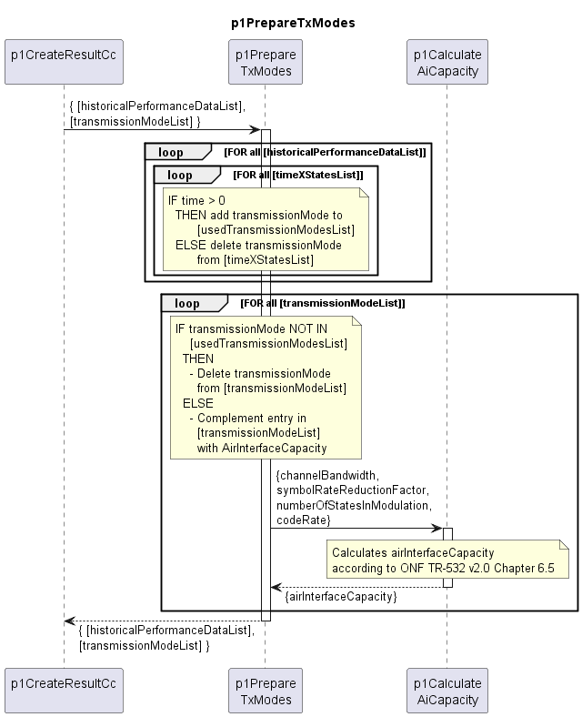

# p1PrepareTxModes

Prepares the transmission mode list by removing unused transmission modes and completing used ones with AirInterface capacity.  

### Diagram

  

### Interface

Please find a detailed description of the [interface](interface.yaml).

### Variables

Please find a detailed description of the [variables](variables.yaml).

### Remarks

Calculating the interval capacity has been moved to p1IterateAiPmSlices with the p2 release of this Function.  
