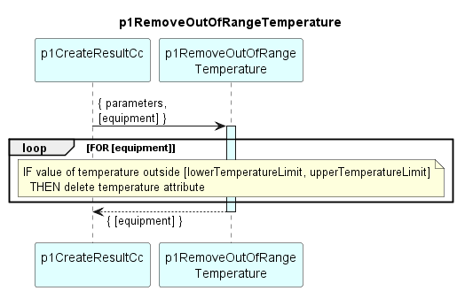

# p1RemoveOutOfRangeTemperature

Deletes temperature attributes with values outside pre-defined range from \[equipment\].  
Borders of the valid range are configurable parameters.  

### Diagram

  

### Interface

Please find a detailed description of the [interface](interface.yaml).

### Variables

Please find a detailed description of the [variables](variables.yaml).

### Parameters

| Parameter Name               | Description                                                                        |
|------------------------------|------------------------------------------------------------------------------------|
| lowerTemperatureLimit        | Lower bound of valid temperature values                                            |
| upperTemperatureLimit        | Upper bound of valid temperature values                                            |

