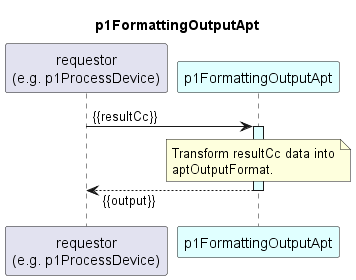

# p1FormattingOutputApt

### Overview  

p1FormattingOutputApt transforms the processed performance data (resultCc) from ONF format to the aptOutputFormat.  
Attributes not found in the resultCc are also omitted from the aptOutputFormat.

### Diagram  

  

### Interface  

Please find a detailed description of the [interface](./interface.yaml).  
Please find a detailed description of the [existing APT interface format](./Output_AptpLegacy.yaml).  

### Variables

Please find a detailed description of the [variables](variables.yaml).
