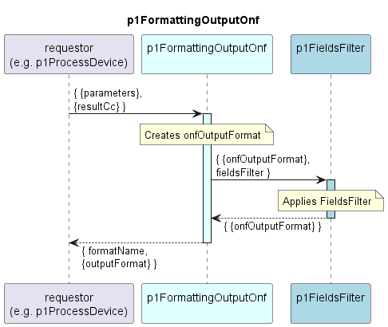

# p1FormattingOutputOnf

Creates an output format from the resultCc.  
Does not modify the data structure but allows applying a configurable fields filter.  

## Diagram

  

## Interface

Please find a detailed description of the [interface](./interface.yaml).  

## Variables

Please find a detailed description of the [variables](variables.yaml).  

## NPM Module

[mw-sdn-p1-formatting-output-onf](https://www.npmjs.com/package/mw-sdn-p1-formatting-output-onf)  
