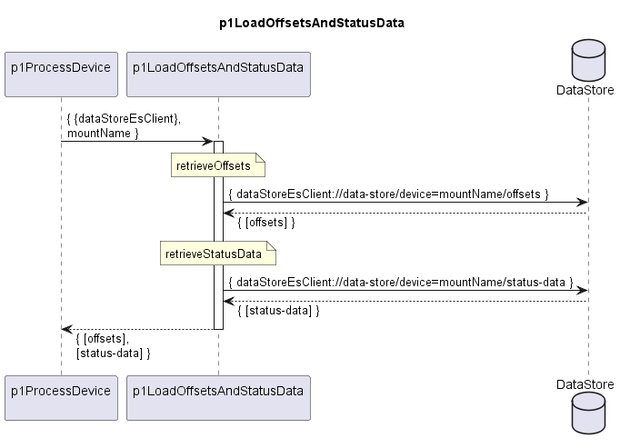

# p1LoadOffsetsAndStatusData

Reads offsets and status data for processing a device from DataStore.  

### Diagram

  

### Interface

Please find a detailed description of the [interface](./interface.yaml).  

### Variables

Please find a detailed description of the [variables](variables.yaml).

### NPM Module

[mw-sdn-p1-load-offsets-and-status-data](https://www.npmjs.com/package/mw-sdn-p1-load-offsets-and-status-data)  

