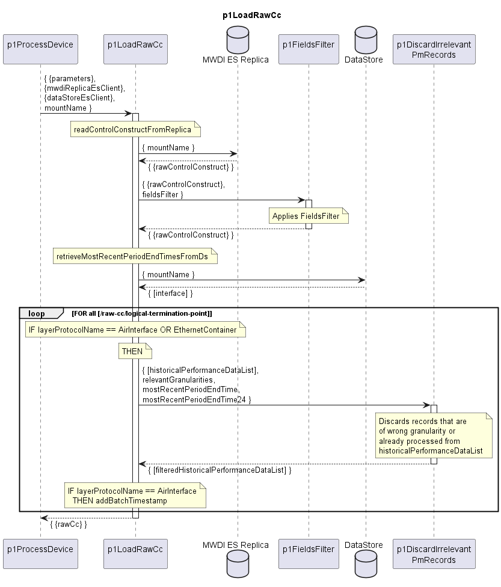

# p1LoadRawCc

Reads ControlConstruct of a device from MWDI ES Replica and filters non-relevant or already processed data.

### Diagram

  

### Interface

Please find a detailed description of the [interface](./interface.yaml).  

### Variables

Please find a detailed description of the [variables](variables.yaml).

### Parameters

| Parameter Name               | Description                                                      |
|------------------------------|------------------------------------------------------------------|
| fieldsFilter                 | Fields filter string to be applied for reducing the rawCc        |
| relevantGranularities        | regex pattern indicating which data granularities are to be kept |

### Remarks:

**Change with DPMDP 1.1.0***  
Additional /raw-cc/batch-timestamp attribute  

