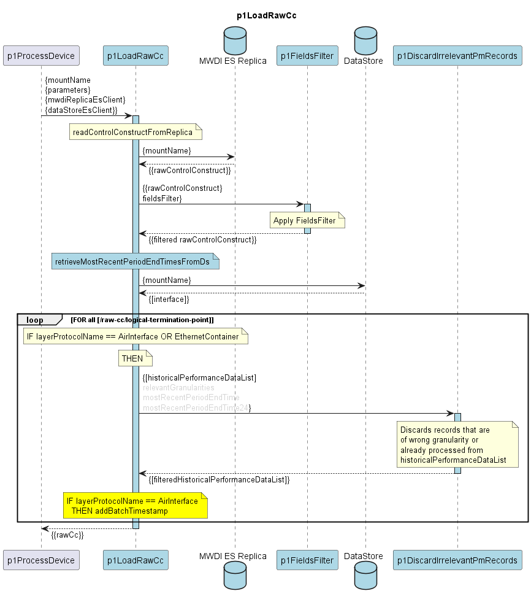

# p1LoadRawCc

Reads ControlConstruct of a device from MWDI ES Replica and filters non-relevant or already processed data.

### Change with DPMDP 1.1.0

p1LoadRawCc had a backward compatible change.  
p1LoadRawCc version 1.1.0 provides an additional /raw-cc/batch-timestamp attribute.  

### Diagram

  

### Interface

Please find a detailed description of the [interface](./interface.yaml).  

### Variables

Please find a detailed description of the [variables](variables.yaml).
