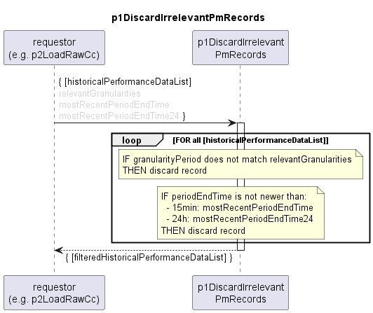

# p1DiscardIrrelevantPmRecords

Discards irrelevant records from historical performance data list.  
Accepts both AirInterface and EthernetContainer PM records.  

### Overview

Records are discarded, if they  
- don't match the configured granularity (15min, 24h, both) or  
- have already been processed in past.  

### Diagram  

  

### Interface  

Please find a detailed description of the [interface](./interface.yaml).  

### Variables

Please find a detailed description of the [variables](variables.yaml).

### Parameters

| Parameter Name               | Description                                                      |
|------------------------------|------------------------------------------------------------------|
| relevantGranularities        | regex pattern indicating which data granularities are to be kept |

### NPM Module  

[mw-sdn-p1-discard-irrelevant-pm-records](https://www.npmjs.com/package/mw-sdn-p1-discard-irrelevant-pm-records)  

