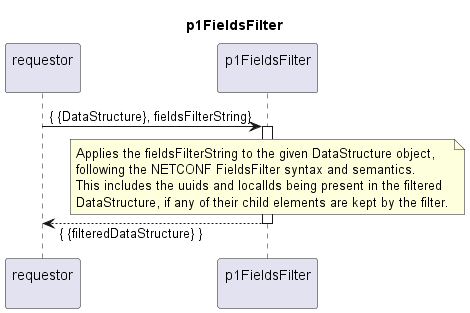

# p1FieldsFilter

Filters a provided data structure according to a provided fields filter string and returns the filtered data structure.  

### Overview

The fields-filtering string must comply with the NETCONF definitions.  
The filtering itself follows the same definitions.  

### Diagram

  

### Interface

Please find a detailed description of the [interface](./interface.yaml).

### Variables

Please find a detailed description of the [variables](./variables.yaml).

### Parameters

| Parameter Name               | Description                                                      |
|------------------------------|------------------------------------------------------------------|
| fieldsFilter                 | Fields filter string to be applied for reducing the rawCc        |

### NPM Module  

[mw-sdn-p1-fields-filter](https://www.npmjs.com/package/mw-sdn-p1-fields-filter)  

