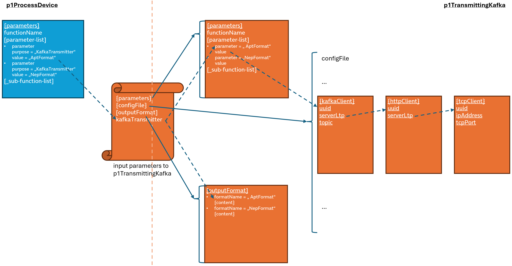
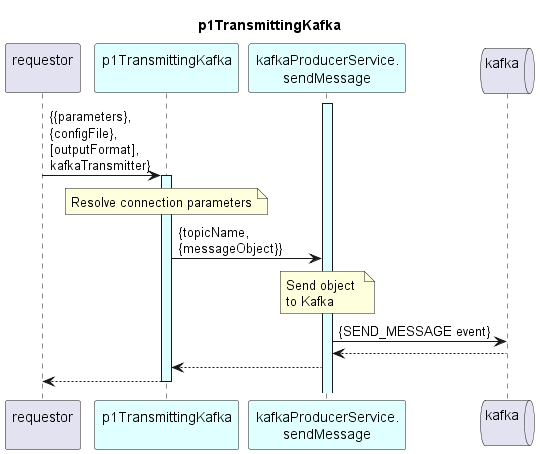

# p1TransmittingKafka

Transfers output data to Kafka.  

### Parameter Handling

One or several Kafka client configurations are defined in the configFile.  
One or several output formats are defined in the outputFormat array.  

The p1TransmittingKafka's input parameter _kafkaTransmitter_ identifies:  
- a parameter in the _parameters_ object that holds the _UUID_ of the KafkaClient in the configFile to be used with this call of p1TransmittingKafka  
- the output format to be transmitted to Kafka with this call of p1TransmittingKafka  

  
  

  

### Diagram  

  
  

  

### Interface  

Please find a detailed description of the [interface](./interface.yaml).  

### Variables

Please find a detailed description of the [variables](./variables.yaml).
