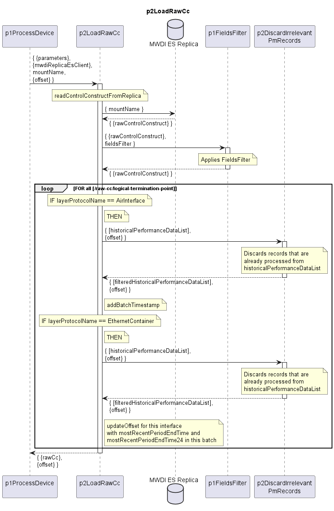

# p2LoadRawCc

Reads ControlConstruct of a device from MWDI ES Replica and filters non-relevant or already processed data.

### Diagram

  

### Interface

Please find a detailed description of the [interface](./interface.yaml).  

> Bitte:  
>- siehe bereits aktualisiertes p2LoadRawCc.plantuml  
  - Zugriff auf DataStore wurde entfernt  
  - offset Object für p2LoadRawCc wird als input übergeben  
  - offset Object an p2DiscardIrrelevantPmRecords als input übergeben und erhalten. 
  - granularity als input für p2DiscardIrrelevantPmRecords entfällt
  - offset wird pro interface mit mostRecentPeriodEndTime und mostRecentPeriodEndTime24 aus dem aktuellen batch aktualisiert  
>- interface.yaml aktualisieren, z.B. aber nicht nur  
>  - input  
>  - processing, z.B. aber nicht nur  
>    - describe new updateOffset precessing step  
>  - from statements  
>- danach diesen Block löschen  

### Variables

Please find a detailed description of the [variables](./variables.yaml).

> Bitte:  
>- siehe bereits aktualisiertes p2LoadRawCc.plantuml  
>- variables.yaml aktualisieren, z.B. aber nicht nur  
>  - mostRecentPeriodEndTime und mostRecentPeriodEndTime24 aus offset Object ableiten
>- danach diesen Block löschen  
