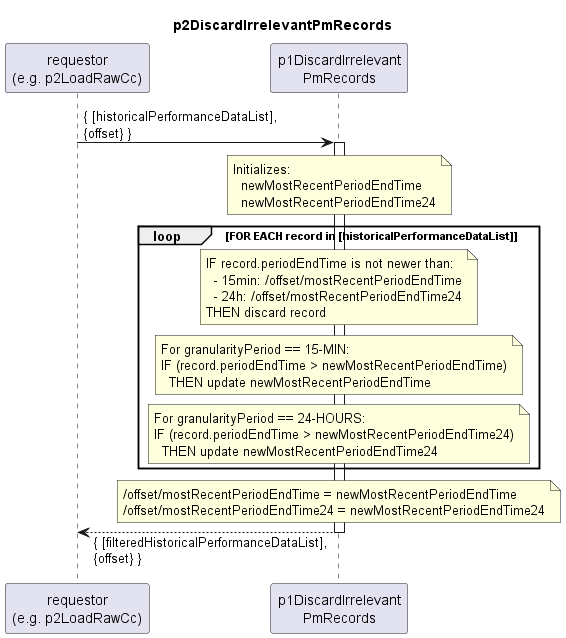

# p2DiscardIrrelevantPmRecords

Discards records that have already been processed in past from historical performance data list.  
Accepts both AirInterface and EthernetContainer PM records.  

Also returns an updated offset containing the mostRecentPeriodEndTimes seen in the current batch.  

### Diagram  

  

### Interface  

Please find a detailed description of the [interface](./interface.yaml).  

### Variables

Please find a detailed description of the [variables](variables.yaml).

### NPM Module  

[mw-sdn-p1-discard-irrelevant-pm-records](https://www.npmjs.com/package/mw-sdn-p1-discard-irrelevant-pm-records)  

