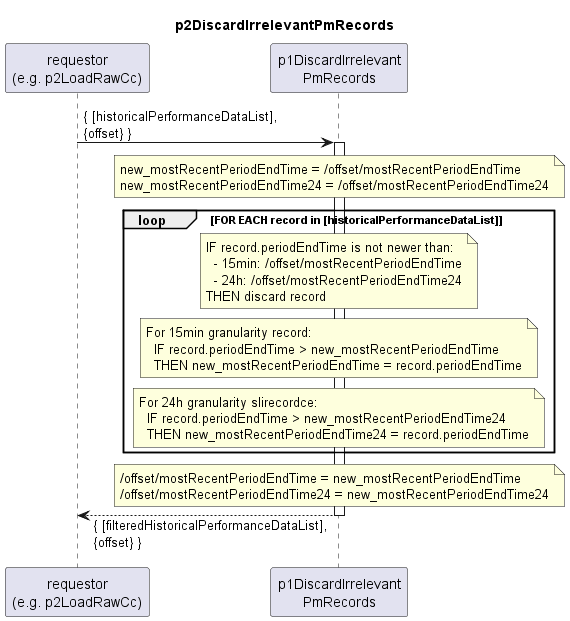

# p2DiscardIrrelevantPmRecords

Discards records that have already been processed in past from historical performance data list.  
Also returns the updated offset containing the mostRecentPeriodEndTimes seen in the input historical performance data list.
(Note: the newest periodEndTime may also come from discarded records.)  
Accepts both AirInterface and EthernetContainer PM records.  

### Diagram  

  

### Interface  

Please find a detailed description of the [interface](./interface.yaml).  

> Bitte:  
>- siehe bereits aktualisiertes p2DiscardIrrelevantPmRecords.plantuml  
  - offset Object für p2DiscardIrrelevantPmRecords wird als input übergeben  
  - granularity, mostRecentPeriodEndTime und mostRecentPeriodEndTime24 entfallen als input
  - offset wird pro interface mit mostRecentPeriodEndTime und mostRecentPeriodEndTime24 aus dem aktuellen batch aktualisiert  
>- interface.yaml aktualisieren, z.B. aber nicht nur  
>  - input  
>  - processing, z.B. aber nicht nur  
>    - describe new updateOffset precessing step  
>  - from statements  
>- danach diesen Block löschen  

### Variables

Please find a detailed description of the [variables](variables.yaml).

### NPM Module  

[mw-sdn-p1-discard-irrelevant-pm-records](https://www.npmjs.com/package/mw-sdn-p1-discard-irrelevant-pm-records)  

