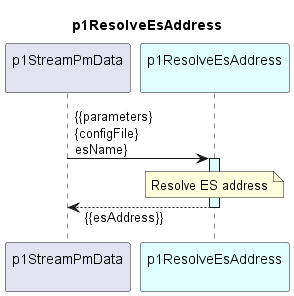

# p1ResolveEsAddress  

p1ResolveEsAddress is composing the address information of an ElasticSearch from Parameters (StringProfile) and Interface (LTP) information.

### Overview  

After getting called, the p1ResolveEsAddress ...  
  - declares internal variables according to variables.yaml
  - composes the output according to the interface.yaml

### Diagram  

  

### Variables  

Detailed description of the [internal variables](./variables.yaml).  

### Interface  

Detailed description of the [interface](./interface.yaml).  

### Parameters

| Parameter Name               | Description                                                                        |
|------------------------------|------------------------------------------------------------------------------------|
| [ElasticSearch name]         | Special usage of the parameters. parameter-name is not static. For all parameters with parameter-name == {$input#/es-name} the value contains the ElasticSearch client's UUID |

### NPM Module  

[mw-sdn-p1-resolve-es-address](https://www.npmjs.com/package/mw-sdn-p1-resolve-es-address)  

