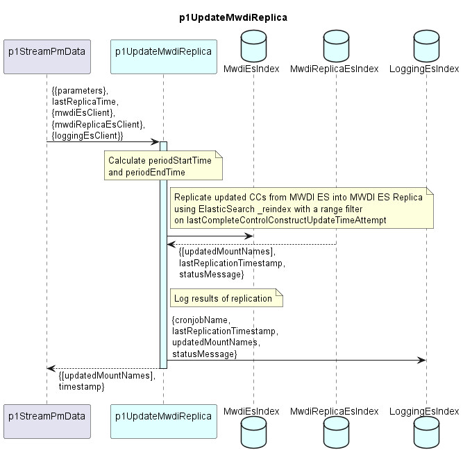

# p1UpdateMwdiReplica

The p1StreamPmData function performs an incremental replication of the MWDI ElasticSearch index into the MWDI ES Replica.  
A new value of the lastCompleteControlConstructUpdateTimeAttempt attribute at a ControlConstruct in the MWDI ES index triggers the same ControlConstruct being replicated into the MWDI ES Replica.  


### Overview  

After getting called, the p1UpdateMwdiReplica ...  

  - Determines the replication time period  
    - periodStartTime = lastReplicaTime - overlapMs  
      (The overlap ensures that no updates at the period boundary are missed)  
    - periodEndTime = current time  

  - Copies all ControlConstructs that changed during this period  
    - Uses the ElasticSearch _reindex API with a range filter on  
      periodStartTime < lastCompleteControlConstructUpdateTimeAttempt <= periodEndTime  
    - Source index: sourceIndex  
    - Destination index: destinationIndex  
    - Existing documents in the Replica are overwritten with the latest version  

  - Updates the replication log in the LoggingEs with  
    - periodStartTime
    - periodEndTime
    - number of replicated ControlConstructs
    - status message

  - returns the list of MountNames of the updated ControlConstructs to the caller


### Diagram  

<p align="center">
  
</p>


### Variables  

Detailed description of the [internal variables](./variables.yaml).  


### Interface  

Detailed description of the [interface](./interface.yaml).  


### Sample code:
```
es.reindex({
  refresh: false,
  wait_for_completion: true,
  requests_per_second: 5, //Throttles reindexing to 5 copy operations per second, preventing high load on the cluster.
  body: {
  source: {
    index: sourceIndex,
    query: {
      range: {
      lastUpdated: {
        gt: periodStartTime, //Reindex documents whose lastUpdated timestamp is 'greater than' (gt) the previous sync start.
        lte: periodEndTime //Reindex documents whose lastUpdated timestamp is 'less than or equal' (lte) to the current sync end.
      }
      }
    }
  },
  dest: {
    index: destinationIndex,
    op_type: "index"
  },
  conflicts: "proceed"
  }
});
```

