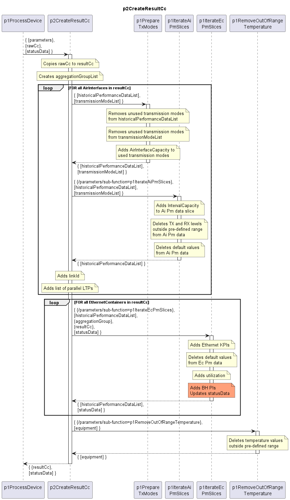

# p2CreateResultCc

### Overview  

The p2CreateResultCc function receives raw data (rawCc) that has already been filtered after retrieving it from the device.  
It creates a copy (resultCc) from the raw data and executes several processing steps on it.  
This processing steps are in a pre-defined sequence, but they can be activated/deactivated independently from each other.  
Receives statusData relevant for Busy Hour computation and updates it.
Finally the resultCc is returned along with updated statusData.  

### Diagram  

  

### Interface  

Please find a detailed description of the [interface](./interface.yaml).  

### Variables

Please find a detailed description of the [variables](variables.yaml).

### Parameters

Just passing through parameters to sub-functions.  

