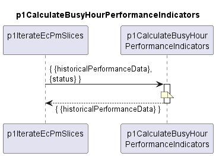

# p1CalculateBusyHourPerformanceIndicators

Determines the busy hour and calculates the busy hour performance indicators.  

### Overview

A high level description of the p1CalculateBusyHourPerformanceIndicators function can be found [here](./../../../../../../../additionalDocumentation/busyHourKpiCalculation.md#module)

  
### Delete_me

Die Datenmengen in den jeweiligen Beobachtungszeiträumen werden aggregiert.  
Die resultierenden 24 aggregierten Datenmengen werden verglichen.  
Der Beobachtungszeitraum mit der höchsten aggregierten Datenmenge wird zur busy hour definiert.  
In den 24-Stunden-Messdaten wird das busy-hour Attribut angelegt.  
label und period-end-time-list werden mit den Werten der busy hour befüllt.  
Die restlichen busy hour performance indicators werden wie oben beschrieben aus den Messwerten der busy hour berechnet und in das busy-hour Attribut eingetragen.  

> Bitte:  
>- die Inhalte des Kapitels Delete_me nach p1CalculateBusyHourPerformanceIndicators.plantuml übertragen  
>- dabei kurz und prägnant ausdrücken (wie andere Diagramme, z.B. ..\p1CreateResultCc\1.0.0\p1CreateResultCc.png)  
>- danach redundante Aussagen vermeiden, meint Kapitel Delete_me hier löschen  
>- danach diesen Block löschen  

### Diagram

  

### Interface

Please find a detailed description of the [interface](interface.yaml).

Übergeben werden:  
- historical-performance-data der aktuellen Messperiode  
- status der p1CategorizeDataVolume Funktion ( /status-data=p1CategorizeDataVolume/status )  
Zurückgegeben wird:  
- historical-performance-data der aktuellen Messperiode  

> Bitte:  
>- die high level Beschreibung von Input und Output hier nach interface.yaml übertragen  
>- die Prozessschritte, die im Diagram kurz und prägnant dargestellt wurden, hier wie sonst üblich detailliert beschreiben
>- dabei wie gewohnt strukturieren (z.B. ..\p1CalculateUtilization\1.0.0\interface.yaml)  
>- danach die high level Beschreibung von Input und Output hier löschen  
>- danach diesen Block löschen  

### Variables

Please find a detailed description of the [variables](variables.yaml).

> Bitte:  
>- den Austausch von Parameterwerten zwischen Input und Output der Funktion selbst sowie der Prozessschritte wie gewohnt über Variablen der Funktion abwickeln (in variables.yaml beschreiben)  
>- Herkunft der Werte ebenfalls wie gewohnt beschreiben  
>- Redundanzen vermeiden, in dem bereits vorher beschriebene Werte nur noch als Objekte dargestellt werden  
>- dabei wie gewohnt strukturieren  
>- danach diesen Block löschen  

### NPM Module  

[mw-sdn-p1-calculate-busy-hour-performance-indicators](https://www.npmjs.com/package/mw-sdn-p1-calculate-busy-hour-performance-indicators)  

