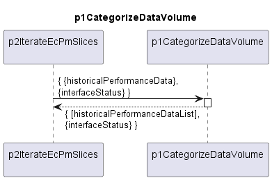

# p1CategorizeDataVolume

### Overview

Performance data measured during 15-minute periods are categorized by day and hour.  
The following parameters are categorized:  
- period-end-time
- total-bytes-output
- total-air-interface-interval-capacity
- errored-frames-input
- dropped-frames-input

When 15-minute-values-by-day exceeds two entries, the oldest entries are deleted (for example, entry 31 is older than entry 1).  

### Diagram

  

### Interface

Please find a detailed description of the [interface](interface.yaml).

### Variables

Please find a detailed description of the [variables](variables.yaml).

### NPM Module

[mw-sdn-p1-categorize-data-volume](https://www.npmjs.com/package/mw-sdn-p1-categorize-data-volume)  
