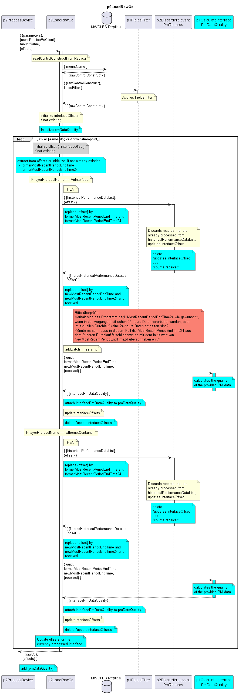

# p2LoadRawCc

Reads ControlConstruct of a device from MWDI ES Replica and filters non-relevant or already processed data.
It receives offsets from the dataStore and returns the updated offsets.  

## Diagram

  

## Interface

Please find a detailed description of the [interface](./interface.yaml).  

## Variables

Please find a detailed description of the [variables](./variables.yaml).
