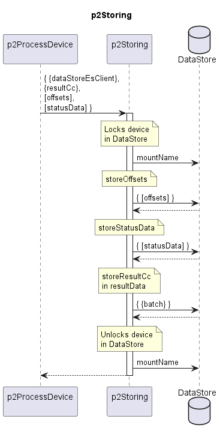

# p2Storing  

Stores the resultCc, offsets and statusData of a device in the dataStore.  

Offsets and statusData of diverse Functions are identified by functionName.  
Offsets are describing the status of the program execution, like pagination or mostRecentPeriodEndTimes.  
StatusData are describing the status of the device, like total-bytes-output values of two 15-minute intervals that need some intermediate storing until the missing two values arrived and the aggregated value for the entire hour can be computed.  

### Diagram  

  
  

  

### Interface  

Please find a detailed description of the [interface](./interface.yaml).  

### Variables

Please find a detailed description of the [variables](./variables.yaml).  

### Schema of the Data Store

Please find a detailed description of the [schema](./data-store-schema/dataStore.yaml).  

