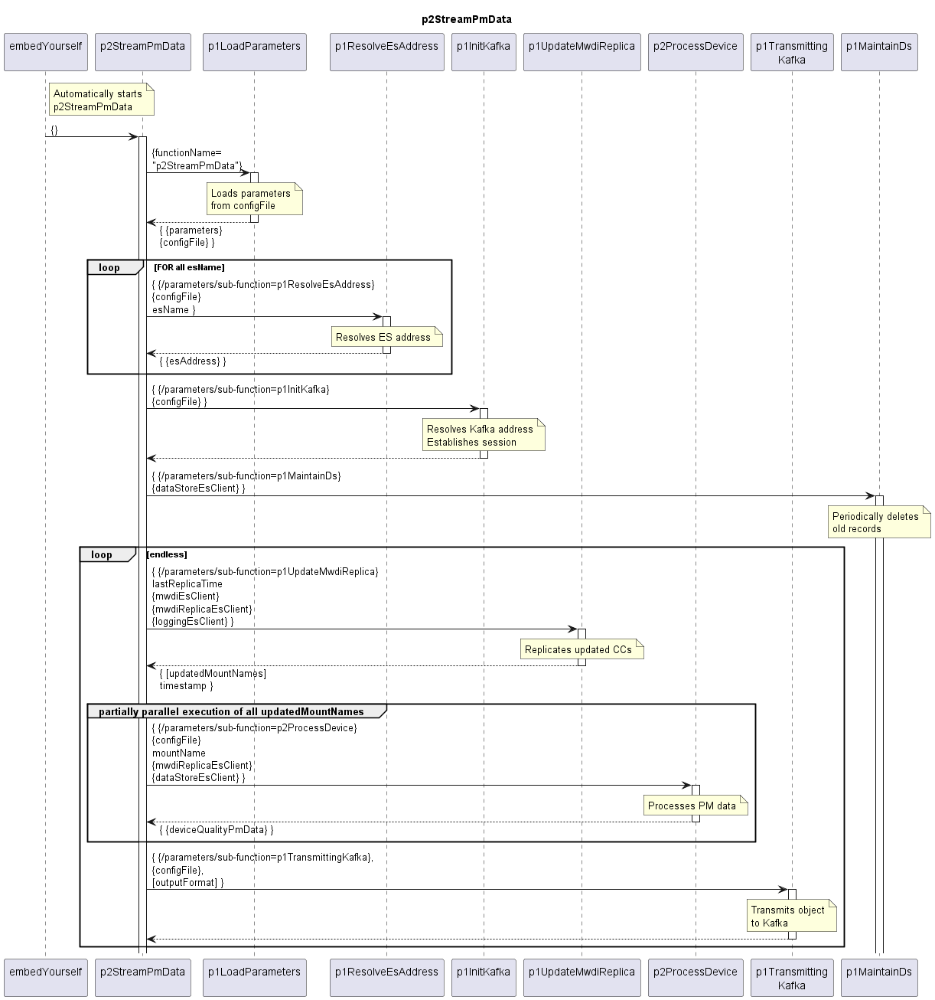

# p2StreamPmData

The p2StreamPmData is cyclically processing:  

- Replicate updated ControlConstructs from the MWDI ES index into the MWDI ES Replica index (which holds the raw data for processing PM data in the DPMDP)
- Initiate the partially parallel processing of PM data of the updated ControlConstructs
- Sending PM data quality information to Kafka

## Diagram

  

## Interface

Detailed description of the [interface](./interface.yaml).  

## Variables

Detailed description of the [internal variables](./variables.yaml).  
