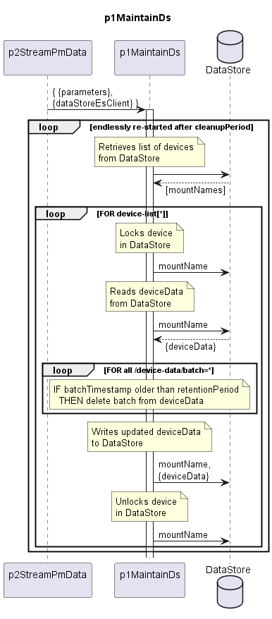

# p1MaintainDs

Periodically deletes resultsCc (with batchTimestamp older than dataStoreRetentionPeriod) from the DataStore  

## Diagram  

  
  

  

## Interface  

Please find a detailed description of the [interface](./interface.yaml).  

## Variables

Please find a detailed description of the [variables](./variables.yaml).

## Parameters

| Parameter Name               | Description                                                           |
|------------------------------|-----------------------------------------------------------------------|
| dataStoreCleanupPeriod       | Time period between two cleanup runs in hours                         |
| dataStoreRetentionPeriod     | Time period for which data is retained before deletion in hours       |

## Comments

The design of the maintenance of the DataStore has several short comings:  

1) It creates a peak in the load on the DataStore when the end of the dataStoreCleanupPeriod is reached.  
2) It locks devices in the DataStore that might be needed for processing the next batch of PM data.  
3) It does not cover deletion of devices from the DataStore.  
4) It is not coupled with de-/activation of storing the resultCc in p2Storing.  
   Creating such coupling is not trivial as de-/activation of the maintenance would have to follow with a delay composed from dataStoreRetentionPeriod and dataStoreCleanupPeriod.  
5) The load, which is generated by p1MaintainDs, does not even shrink in case storing the resultCc in p2Storing is deactivated.  
