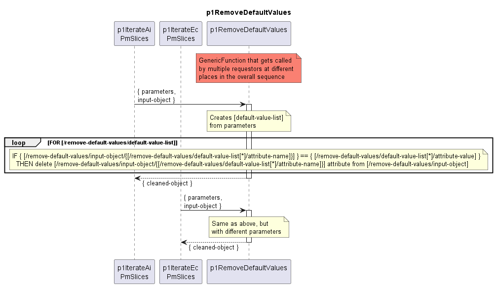

# p1RemoveDefaultValues

Deletes attributes with default values from the transferred object.  

## Diagram

  

## Interface

Please find a detailed description of the [interface](interface.yaml).  

## Variables

Please find a detailed description of the [variables](variables.yaml).  

## Parameters

| Parameter Name               | Description                                                                                                                                                                                   |
|------------------------------|-----------------------------------------------------------------------------------------------------------------------------------------------------------------------------------------------|
| [attributeName]              | Special usage of the parameters. parameter-name is not static. For all parameters handed over to this function, parameter-name contains an attributeName and value identifies a default value |

## NPM Module

[mw-sdn-p1-remove-default-values](https://www.npmjs.com/package/mw-sdn-p1-remove-default-values)  
