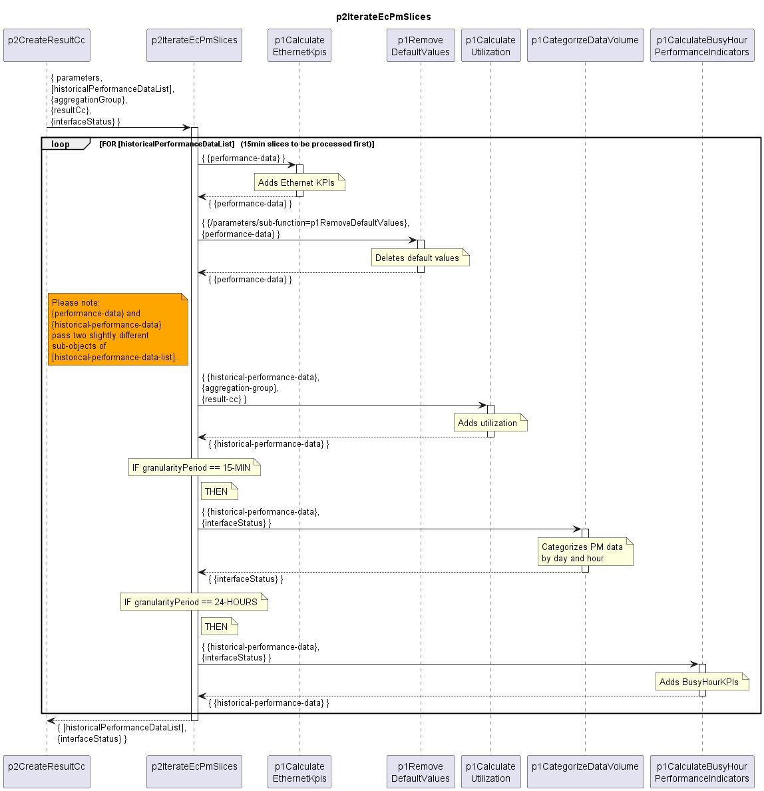

# p2IterateEcPmSlices

Iterates through all 15-min PM values at the EthernetContainer and calls the processing Functions.  

**Iteration order**  
The key attributes for iterating through the PM slices are periodEndTime and granularity.  
It must be ensured that the function first iterates through all 15min PM slices, before potentially contained 24h PM slices are processed.  

## Diagram

  

## Interface

Please find a detailed description of the [interface](./interface.yaml).  

## Variables

Please find a detailed description of the [variables](./variables.yaml).  

## Parameters

Just passing through parameters to sub-functions.  

## NPM Module

[mw-sdn-p2-iterate-ec-pm-slices](https://www.npmjs.com/package/mw-sdn-p2-iterate-ec-pm-slices)  
