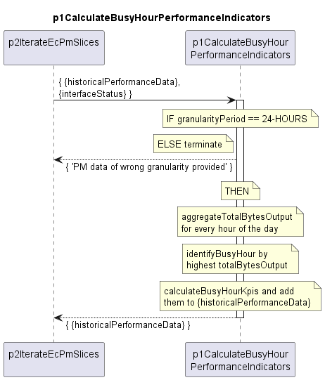

# p1CalculateBusyHourPerformanceIndicators

Determines the busy hour and calculates the busy hour performance indicators.  

## Overview

A high level description of the p1CalculateBusyHourPerformanceIndicators function can be found [here](./../../../../../../../additionalDocumentation/busyHourKpiCalculation.md#module).  

## Diagram

  

## Interface

Please find a detailed description of the [interface](interface.yaml).  

## Variables

Please find a detailed description of the [variables](variables.yaml).  

## NPM Module

[mw-sdn-p1-calculate-busy-hour-performance-indicators](https://www.npmjs.com/package/mw-sdn-p1-calculate-busy-hour-performance-indicators)  
