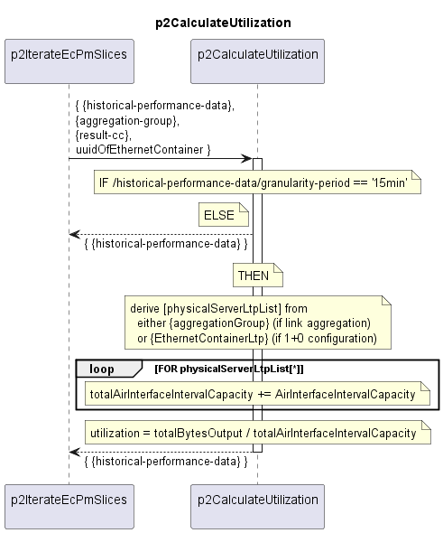

# p2CalculateUtilization

Calculates the utilization of the aggregated physical TX resources in a performance data slice.  

Sums up the interval capacity of all AirInterfaces in the aggregation group that is transporting the EthernetContainer.  
Divides the totalBytesOutput by the aggregated interval capacity to get the utilization in %.  

## Diagram

  

## Interface

Please find a detailed description of the [interface](./interface.yaml).  

## Variables

Please find a detailed description of the [variables](./variables.yaml).  

## NPM Module

[mw-sdn-p2-calculate-utilization](https://www.npmjs.com/package/mw-sdn-p2-calculate-utilization)
