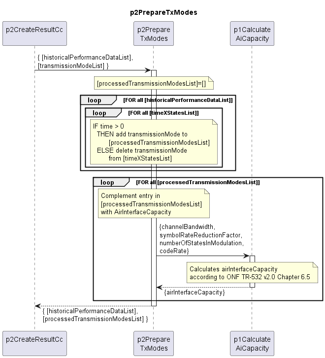

# p2PrepareTxModes

Prepares the transmission mode list by removing unused transmission modes and completing used ones with AirInterface capacity.  

## Diagram

  

## Interface

Please find a detailed description of the [interface](interface.yaml).  

## Variables

Please find a detailed description of the [variables](variables.yaml).  

## NPM Module

[mw-sdn-p2-prepare-tx-modes](https://www.npmjs.com/package/mw-sdn-p2-prepare-tx-modes)  
