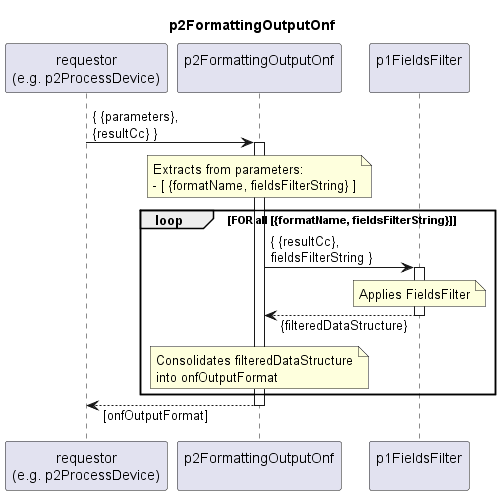

# p2FormattingOutputOnf

Creates a list of ONF based output formats from the resultCc.  
Does not modify the data structure but allows applying an individually configurable fields filter.  

## Diagram

  

## Interface

Please find a detailed description of the [interface](./interface.yaml).  

## Variables

Please find a detailed description of the [variables](./variables.yaml).  

## Parameters

| Parameter Name               | Description                                                                                                                                                                                       |
|------------------------------|---------------------------------------------------------------------------------------------------------------------------------------------------------------------------------------------------|
| [onfFormatName]              | Special usage of the parameters. parameter-name is not static. For all parameters with purpose=="fieldsFilter", parameter-name contains a onfFormatName and value contains the fieldsFilterString |

## NPM Module

[mw-sdn-p2-formatting-output-onf](https://www.npmjs.com/package/mw-sdn-p2-formatting-output-onf)  
