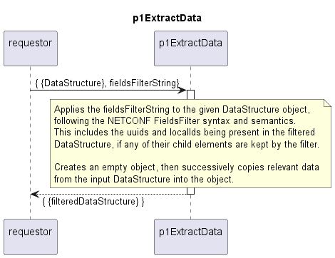

# p1ExtractData

The function creates a new object and successively copies the relevant data from the input data structure into the newly created object.

The function should be used in the following scenarios:

- when only a small subset of the input data is relevant and needs to be retained
- when the original input data object must remain unchanged

A fields filter string is used to specify which data from the input data structure is considered relevant.

Note: the implementation follows the one of the generic p1FieldsFilter function.

## Overview

The fields-filtering string must comply with the NETCONF definitions.  
The filtering itself follows the same definitions.  

## Diagram

  

## Interface

Please find a detailed description of the [interface](./interface.yaml).

## Variables

Please find a detailed description of the [variables](./variables.yaml).

## NPM Module  

[mw-sdn-p1-extract-data](https://www.npmjs.com/package/mw-sdn-p1-extract-data)  