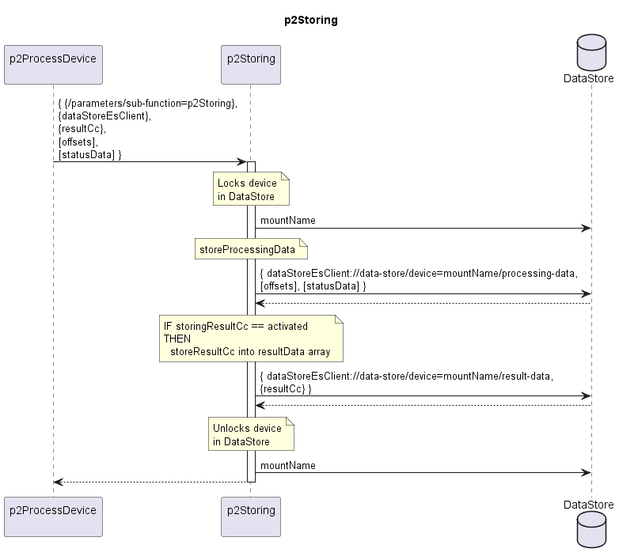

# p2Storing  

Stores the resultCc (if activated), offsets and statusData of a device in the DataStore.  

Offsets and statusData of diverse Functions are identified by functionName.  
Offsets are for describing the status of the program execution, like pagination or mostRecentPeriodEndTimes.  
StatusData are for describing the status of the device, like total-bytes-output values of two 15-minute intervals that need some intermediate storing until the missing two values arrived and the aggregated value for the entire hour can be computed.  

**Attention**  
Storing of the resultCc is deactivated by default.  
Activating it requires activating the p1MaintainDs function, too!  
Please be aware that the deactivation of the p1MaintainDs function must be done a long while (maybe even several days) after the deactivation of the storing of the resultCc.  
Otherwise, the DataStore would stay permanently inflated with useless data.  

## Diagram  

  
  

  

## Interface  

Please find a detailed description of the [interface](./interface.yaml).  

## Variables

Please find a detailed description of the [variables](./variables.yaml).  

## Schema of the DataStore

Please find a detailed description of the [schema](./data-store-schema/dataStore.yaml).  

## NPM Module  

[mw-sdn-p2-storing](https://www.npmjs.com/package/mw-sdn-p2-storing)  
