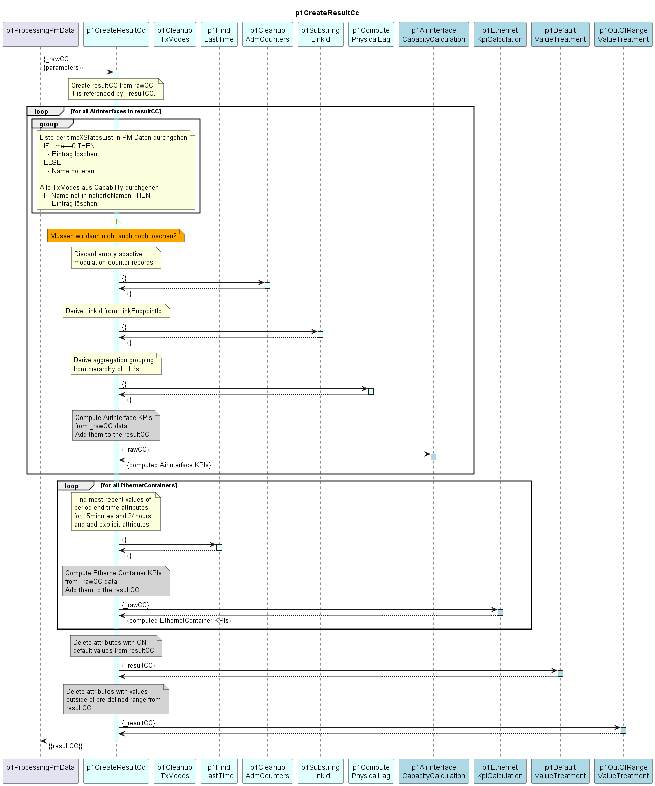

# p1CreateResultCc

### Overview  

The p1CreateResultCc function receives raw data (rawCc) that has already been filtered after retrieving it from the device.  
It creates a copy from that (resultCc) and executes several processing steps on it.  
The processing steps can be activated/deactivated independently from each other.  
Further processing steps can be added in future without changing the existing ones.  
Of course the order of the processing steps is important, particularly if they are altering the same attributes of the resultCc. 
Finally the resultCc is returned.  

The following processing steps are currently implemented:
<!-- TODO: List of processing steps to be completed -->
- Filtering empty/incomplete adaptive modulation data from PM data and capabilities  

### Diagram  

  

### Interface  

Please find a detailed description of the [interface](./interface.yaml).  

