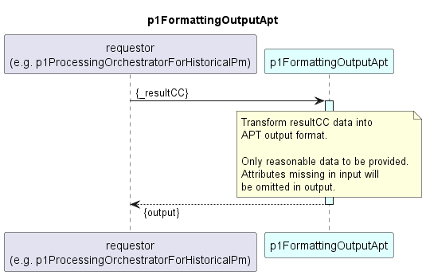

# p1FormattingOutputApt

### Overview  

The p1FormattingOutputApt function transforms the result ControlConstruct from ONF format into the [APT output format](./InformationStructure/OutputApt.yaml).  
As only reasonable data shall be provided, attributes not found in the input (resultCC) are also omitted from the generated output.

### Diagram  

  

### Interface  

Please find a detailed description of the [interface](./interface.yaml).  
