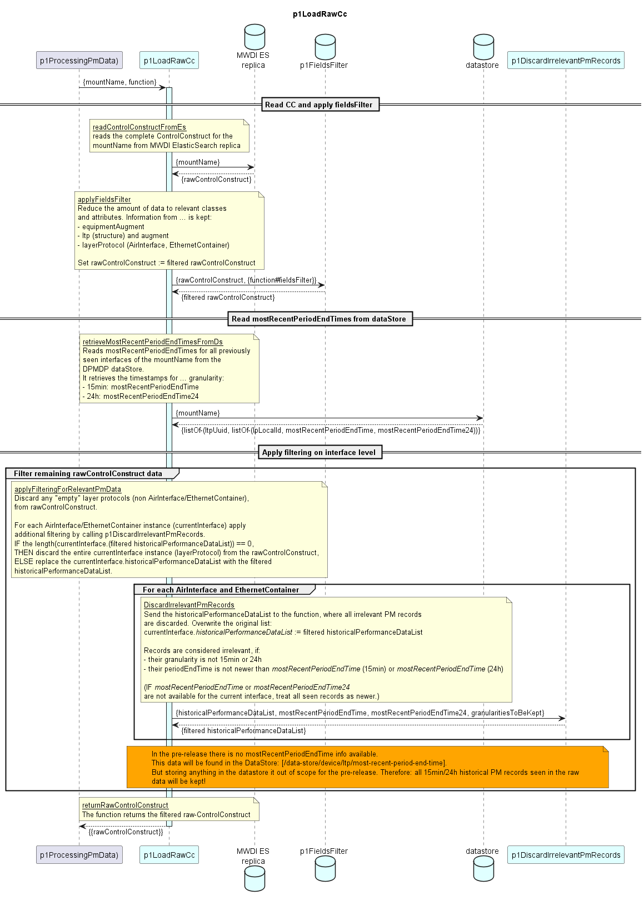

# p1LoadRawCc

**TODO**:
- update for usage of new generic function p1DiscardIrrelevantPm
- consolidate parameter handover by function usage

### Overview  

The p1LoadRawCc function receives the mountName of a device as input and reads the raw ControlConstruct data of this
device from the MWDI ES replica.  
It processes the raw ControlConstruct data and filters out unwanted data.  
The filtered raw ControlConstruct is returned as output.  

The following generic function is called to reduce the data of raw ControlConstruct:
- [p1FieldsFilter](https://github.com/openBackhaul/ApplicationPattern/tree/develop/spec/genericFunctions/p1FieldsFilter/1.0.0)  

### Diagram  

  

### Interface  

Please find a detailed description of the [interface](./interface.yaml).  

### NPM Module  

There is no NPM module as this is not a generic function.

### Processing Details

**p1FieldsFilter usage**  
The following generic function is called to reduce the data of raw ControlConstruct:
- [p1FieldsFilter](https://github.com/openBackhaul/ApplicationPattern/tree/develop/spec/genericFunctions/p1FieldsFilter/1.0.0)  

The provided fields filter is specified as function parameter. The related stringProfile instance is *dpmdp-1-0-0-string-p-021*.  
Note that the filter may contain a complete class, although not attributes from that class are required. The irrelevant attributes will be filtered out during a later processing step of this function.  

The fields filter currently looks as follows:  
`equipment-augment-1-0:control-construct-pac(external-label;device-model-name);logical-termination-point(uuid;client-ltp;server-ltp;ltp-augment-1-0:ltp-augment-pac(external-label;original-ltp-name);layer-protocol(local-id;layer-protocol-name;air-interface-2-0:air-interface-pac(air-interface-configuration(transmission-mode-min;transmission-mode-max;tx-power;atpc-is-on;atpc-thresh-upper;atpc-thresh-lower);air-interface-capability(transmission-mode-list);air-interface-historical-performances);ethernet-container-2-0:ethernet-container-pac(ethernet-container-historical-performances)))`

---

**Processing steps**  
1. read the raw ControlConstruct from ES
2. apply generic function p1FieldsFilter to reduce the data in raw ControlConstruct to relevant subclasses and attributes
   - the remaining data still contains irrelevant data, that needs to be filtered out
   - e.g. for layerProtocol instances which are not to AirInterfaces or EthernetContainers the layerProtocol will be there, but without proper data
3. read timestamp information about already previously gathered data:
   - from the DPDMP datastore read the device object, which matches the input mount-name
   - this object contains a list of ltp/lps with most-recent-period-end-time information (in case of a new device, the list will be empty)
3. special filtering is applied to the data remaining from step2. This is done in step `applyFilteringForRe`.
  If a different filtering should be applied in a future release, another filter step could be added and executed instead.  
  In this step irrelevant information is to be discarded. Therefore, only
  - keep relevant equipment-augment information
  - keep relevant information about LTP structure and augment
  - keep layer-protocol information, only if the layer-protocol is either an AirInterface or EthernetContainer instance
    - inside the layer-protocol only keep historical PM records,
      - which are of 15min or 24h granularity
      - and where the period-end-time is newer than the most-recent-period-end-time for this interface instance from step2
      - note: if in step2 no data was found for the mount-name at all, or if the found data does not contain an entry for a specific interface, all data for that mount-name/interface is treated as newer.
    - interface instances (layer-protocols) are only to be kept in the raw ControlConstruct if historical PM records remain after filtering has been applied

Note:
- Only layer-protocols are discarded (if they are no AirInterfaces or EthernetContainers) - the LTPs containing them are kept, as they are required for ID computation.
- The function currently does not contain any additional filter rules (e.g. removal of default values, etc.).
- The raw ControlConstruct data follows ONF format. Only relevant attributes and subclasses are kept.