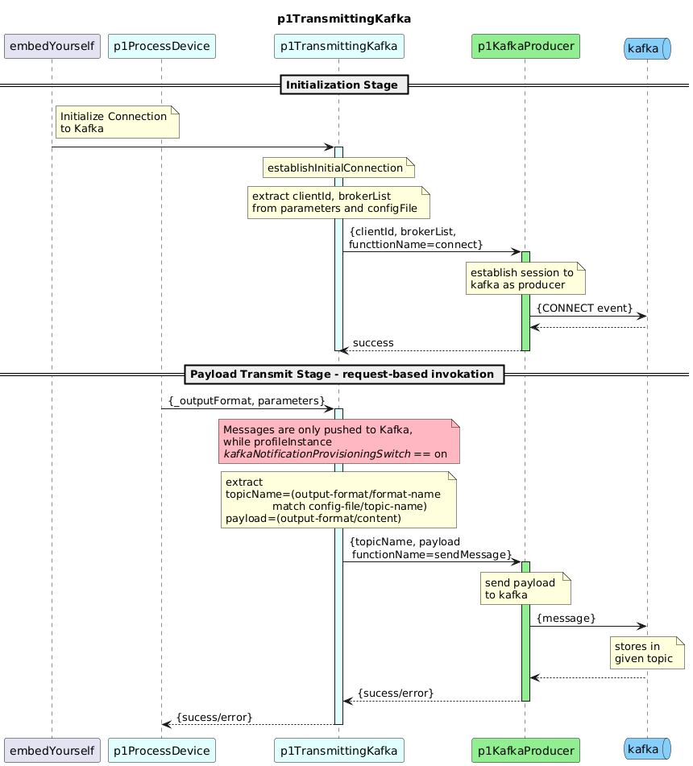

# p1TransmittingKafka

This module defines the architectural procedure for transferring processed pm data from p1ProcessDevice module into Kafka. It handles data extraction, outputFormat‑based routing, and message delivery to the appropriate Kafka topics.

## Description

### Initialize Kafka Connection

- The initialization sequence is triggered by embedYourself, which starts the setup of the Kafka transmission module.
- With the input data from p1ProcessDevice module, the connection to Kafka is initialized using attributes such as client-id and broker-list, where 
  - broker-list represents the set of [address:port] endpoints where the Kafka cluster is deployed.
  - client-id is obtained from the kmb-client section of the configuration file, while the broker-list is retrieved from the Kafka tcp-client configuration.
- _connect_ operation of the generic function _p1KafkaProducer_ is invoked to establish the producer session with kafka.
- This initialization is performed only once, and the module begins transmitting messages immediately after the Kafka connection is successfully established.

### Payload Transmission

- The function receives processed pm data from p1ProcessDevice as _outputFormat
- The _outputFormat array is iterated entry‑wise. For each object, the _format-name_ field is compared against the string-name _kafkaProducerClientFor*_ under the function _p1TransmittingKafka_ given in input config-file to decide the respective target topic.
- Further, the _content_ field (representing the actual message payload) from _outputFormat is forwarded, together with the selected topic name, to the sendMessage function of the  _p1KafkaProducer_ module.

#### Configuration

- Each Kafka topic is associated with a dedicated client configuration entry within the configuration file. The kmb-client entries are referenced in string-profile and then included under the parameter-list of _p1TransmittingKafka_ to enable automated handling of topic-specific configurations.

#### kafkaDataProvisioningSwitch

- The _kafkaDataProvisioningSwitch_ is an independent configuration parameter (string-profile) used to determine whether payloads should be transmitted to Kafka
- After the Kafka connection has been successfully established and the application begins sending data, the value of this switch is evaluated. If the switch is set to on (the default), payload transmission to Kafka is permitted. Conversely, if the switch is set to off, payloads are suppressed and not forwarded to Kafka.

### Diagram  

  
  

  

#### Further notes

- Data is published to Kafka topics based on its outputFormat.
- All messages with the same outputFormat are routed to a single dedicated topic. Multiple consumers can independently read the same topic by using unique group.id values.
- Different outputFormat values map to different topics.
- Kafka partition count is configurable and should be tuned based on expected throughput and load characteristics.

Further, the interface definition could be found in [interface](interface.yaml)

The generic function [p1KafkaProducer](https://github.com/openBackhaul/ApplicationPattern/tree/develop/spec/genericFunctions/p1KafkaProducer/1.0.0) is utilized to establish the Kafka connection and transmit messages.
