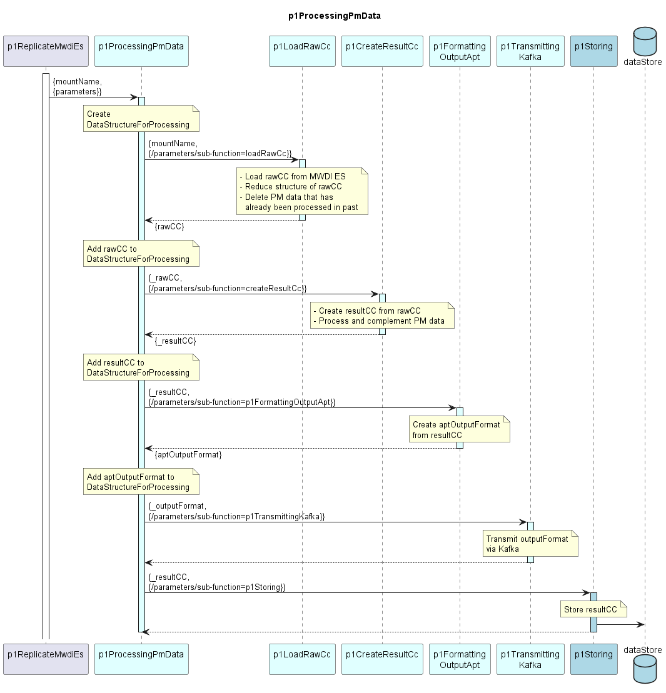

# p1ProcessingPmData  

Orchestrates the device-wise processing, formatting, sending and storing of PM data.  
Calculating the PM data is separated from formatting and transmitting.  
This allows to define multiple output formats from the same calculated PM data.  
Transmitting is also separated, enabling the same output format to be sent through multiple transmission methods, or multiple output formats to be sent via the same transmission method.

### Description  

The p1ProcessingPmData starts with creating a data structure for holding raw data, results, and administrative information.  
This data structure is called [DataStructureForProcessing](./InformationStructure/DataStructureForProcessing.yaml).  

The p1ProcessingPmData executes a hard coded sequence of Functions.  
Before calling a Sub-Function, it checks its parameters for the Sub-Function being activated.  

Parameters for these Functions are handed over by function object.  

Variable Input to these Sub-Function is handed over as references into the DataStructureForProcessing.  
**Sub-Functions are not allowed to alter data in the DataStructureForProcessing.**  

Output of the Sub-Functions is handed over as data objects.  
These data objects are attached to the DataStructureForProcessing.  

### Diagram  

  
  

  

### Interface  

Please find a detailed description of the [interface](./interface.yaml).  

